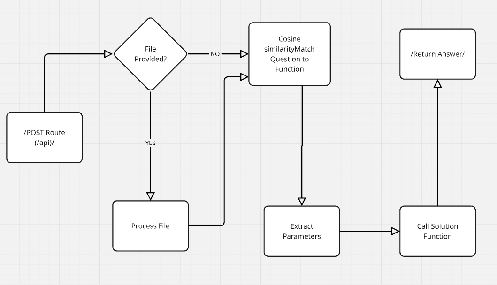

## **How to Run the App Locally**

To run the app on your local machine, follow these steps:

### **1. Clone the Repository**
First, clone the repository to your local machine:
```bash
git clone https://github.com/your-username/TDS-project-2.git
cd TDS-project-2
```

### **2. Set Up a Virtual Environment**
Create and activate a virtual environment to manage dependencies:
```bash
python3 -m venv venv
source venv/bin/activate  # On Windows, use `venv\Scripts\activate`
```
or use uv 

```bash
uv venv
source venv/bin/activate  # On Windows, use `venv\Scripts\activate`
```

### **3. Install Dependencies**
Install the required Python packages:
```bash
pip install -r requirements.txt
```

or use uv
```bash
uv pip install -r requirements.txt
```

### **4. Set Up Environment Variables**
Create a `.env` file in the project root and add the necessary environment variables:
```env
AIPROXY_TOKEN=your_openai_api_key
```

### **5. Run the Application**
Start the Flask development server:
```bash
python -m api.app
```

The app will be available at `http://127.0.0.1:5000`.

### **6. Test the API**
You can test the API using tools like `curl` or Postman. For example:
```bash
curl -X POST "http://127.0.0.1:5000/api/" \
  -H "Content-Type: multipart/form-data" \
  -F "question=What is the output of code -s in VS Code?"
```

### **7. Stop the Server**
To stop the server, press `Ctrl+C` in the terminal.

---

Now you’re ready to develop and test the app locally! 😊

## **How It Works (In Simple Terms)**

<!-- add ./idea.png present in current dir -->


### **Step 1: Receive User's Question**
When someone hits the **`/api/`** endpoint with a **POST** request, the API will:
- Take the **question** from the request.
- Optionally take a **file** (like a ZIP or CSV) if required by the question.

Example request:
```bash
curl -X POST "https://your-app.vercel.app/api/" \
  -H "Content-Type: multipart/form-data" \
  -F "question=What is the output of code -s in VS Code?" \
  -F "file=@abcd.zip"
```

### **Step 2: Match the Question to a Solution**
- After receiving the question, the API will **compare** the user’s question with a list of predefined questions (stored in a JSON file).
- To do this, we’ll use **cosine similarity** to see which question in our database is the most similar to the user's question. If the question is similar enough, it will match to a **specific function** we’ve written for that question.

For example, if the user asks:
> “What is the output of `code -s` in VS Code?”

The system would match this question with the `"vs_code_version"` function.

### **Step 3: Extract Parameters**
Once we know which function to use, the system will need to figure out **what information** it needs to run that function. This is done by **extracting parameters** from the user’s question.

For example, if the question is about sending an HTTP request, we need to extract the **URL** and any **parameters** (like an email address) from the question.

To do this, we use the **OpenAI API** to help us figure out the necessary details (parameters) from the question.

### **Step 4: Call the Solution Function**
Once we have the matching function and the required parameters, we’ll **call the appropriate solution function** to get the answer. Each question corresponds to a specific solution function that we’ve already written.

For example:
- **For HTTP requests**: We might use the `send_http_request` function.
- **For VS Code version**: We would use the `vs_code_version` function.

The function will then return the answer.

### **Step 5: Return the Answer**
Finally, the API will return the answer as a **JSON response** so the user can easily copy-paste it into their assignment.

Example response:
```json
{
  "answer": "VS Code version 1.52.1"
}
```

---

## **Plan Breakdown: How We’re Building It**

### **1. The `/api/` Route**
This is where all the magic happens. The user will send a **POST** request with:
- **question**: The query they're asking.
- **file** (optional): If they uploaded a file (like a ZIP containing a CSV), we’ll process it.

Here’s a simplified view of the code for the `/api/` route:
```python
@app.route('/api/', methods=['POST'])
def process_file():
    question = request.form.get('question')  # Get the question from the request
    file = request.files.get('file')  # Get the file (optional)

    # Handle file processing (if a file is provided)
    if file:
        process_file_logic(file)

    # Match the question to the correct function
    matched_function = match_question_to_function(question)

    # Extract parameters from the question
    parameters = extract_parameters(question)

    # Get the answer by calling the right solution function
    answer = call_solution_function(matched_function, parameters)

    # Return the answer as a JSON response
    return jsonify({"answer": answer})
```

### **2. Matching Questions with Functions**
We’ve got a list of questions (in a JSON file), and when a user submits a question, we compare it to our list using **cosine similarity**. This helps us find which predefined question matches best.

For example, if someone asks:
> "How do I run an HTTP request using `httpie`?"

We compare it with predefined questions like:
- “Make HTTP requests with UV”
- “Run command with npx”

The one that’s the most similar gets selected, and we call the corresponding function to handle that question.

```python
def match_question_to_function(question):
    # Compare the user's question with predefined questions using cosine similarity
    # Return the matched function key
```

### **3. Extracting Parameters Using OpenAI API**
Once the matching function is selected, we need to extract the required parameters for that function. So, we send the question to **OpenAI** and ask it to identify the **parameters** we need to pass into the function.

Example:
- If the question is about making an HTTP request, OpenAI might extract:
  - **url**
  - **email** (as a query parameter)

```python
def extract_parameters(question):
    # Use OpenAI to extract parameters like URL, email, etc.
    # Return the extracted parameters
```

### **4. Calling the Solution Function**
Once the parameters are extracted, we call the appropriate function. Here’s how we call the function based on the matched question:

```python
def call_solution_function(function_name, parameters):
    if function_name == "send_http_request":
        return send_http_request(parameters)
    elif function_name == "vs_code_version":
        return vs_code_version(parameters)
    # Add more function calls here for other solutions
```

### **5. Return the Answer**
After calling the solution function, we return the answer in JSON format, ready for the user to copy and paste into their assignment.

Example:
```json
{
  "answer": "The output of code -s is: Version 1.50.0"
}
```

---

## **Final Thoughts**

This project will automatically handle questions that come up in the graded assignments. It uses **cosine similarity** to match the question to a predefined function, **OpenAI** to extract parameters, and then executes the relevant solution function.

- **What’s next?**
  - Add more predefined questions and solutions.
  - Improve the matching function and parameter extraction logic.
  - Test the entire flow thoroughly!

If you have any questions or suggestions, feel free to drop them here! 😊
